# Git and GitHub Tutorial for Beginners

The Git and GitHub guide is based on this [tutorial](https://www.bilibili.com/video/BV1vy4y1s7k6/?spm_id_from=333.788.player.switch&vd_source=fa53aac2f51b4e0b01bd061c1f708fff&p=7).  

## Preface

### How to Open Git Bash
Since my *git* is installed in `C:/Program Files`, to open git bash, always go to desktop and right click and then choose `Open Git Bash Here`.

### Folder Structure

Each local folder need to have at least one *.txt* file for GitHub to display the folder structure right (exactly like the local folder structure), otherwise two folders will be displayed as a flat folder instead of nested folders.

### Local-to-GitHub Using Git (Pull-Merge-Commit-Push) Workflow
Using my "Knowledge" folder (which is applied `git init`) as an example:

If you have made a lot changes and you want to syncnize them all to your GitHub repository:

1. `git pull Knowledge master` This is to make sure your are not behind what's in your GitHub respository. Your latest work will not lost after this `pull`.

2. If you are indeed behind what is currently in GitHub, after the previous step, you will see "Git的合并提交编辑器"（下图），这不是出错了。这个界面是让你确认这次`git pull`产生的`merge commit`信息。只需要输入`:wq`+`enter`即可。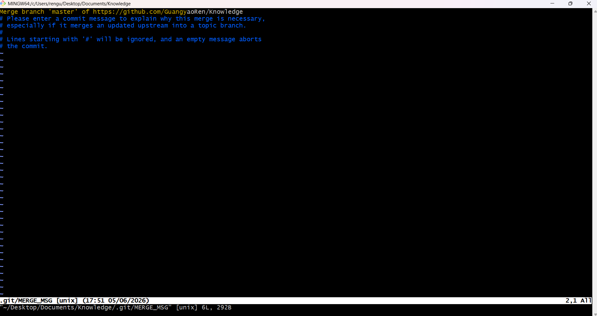 Now, you are on the same page as your GitHub repository.

3. We can update our work done today to GitHub now. This is the usual routine: `git status` `→` `git add .` `→` `git commit -m "update all"` `→` `git push Knowledge master`.

### General Git Commands Guide

* Those commands in `Git bash` is the same as the those in `Linux`。

* 如果一个文件夹内有很多文件，需要改文件夹名字的时候执行git `mv <OldName> <NewName>` . 比如这个例子 `git mv "555_Read Me" 555_Read_Me`. 这里“xxxxxx”的双引号不必须，这里加了是因为原来的文件夹名字有莫名的空格。然后另一台机器只需要 执行 `git pull <RemoteName> <BranchName>` 即可。

* 要创建一个新的文件夹，只需要在本地创建一个文件夹（里面至少要有一个".txt"文件）然后在这个新创建的文件夹里面鼠标右键，选择`Git Bash Here`，然后`git add`， `git commit -m “xxxxxx”`， `git push <RemoteName> <BranchName>`就好了，另一个人git pull就好了。

* 当第一次要把GitHub的文件弄到本地库时，是`git clone <该repository的HTTPS链接>`，而不是用`git pull`，`git pull`是当本地库已经有了该repository的时候用的，所以`git pull`相当于更新。

| Command               | Action                        |
| :-----                | :-----                        |
| `cmd` + `shift` + `.` | to hide files in Mac system   |
| `git remote -v`       | to view the repository remoteName  |
| `git remote rename <OldName> <NewName>` | to change the repository remoteName   |

## 1. Git是一个开源的分布式版本控制工具（不是集中式版本控制工具 e.g., CVS, SVN）

[Git Official Website](https://git-scm.com/)

**工作区**：是写的代码存放的本地磁盘区（可以删掉）

`↓` `git add`

**暂存区**：代码只是临时存储在暂存区（依然可以删掉）

`↓` `git commit`

**本地库**：一旦提交到本地库，就会生成对应历史版本，就不能删掉了

`↓` `push`

**远程库** (托管中心, 比如GitHub)

## 2. Git的安装
Follow the screenshoots below.

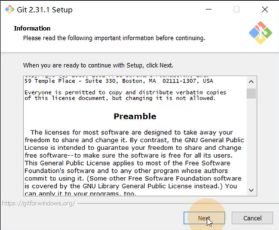
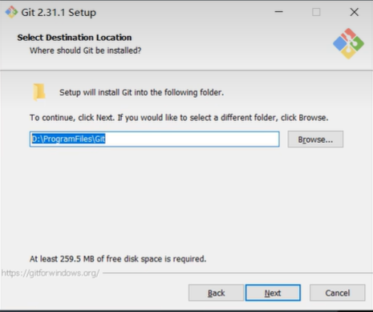
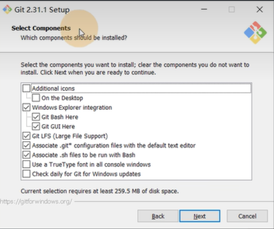
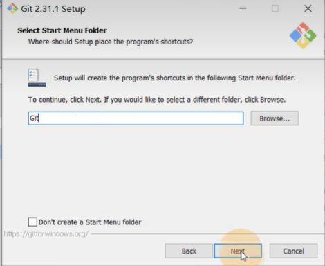
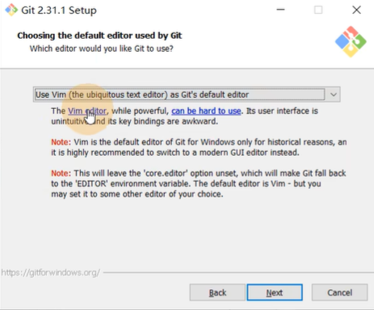
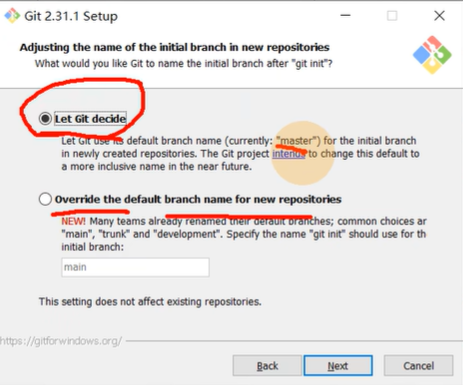
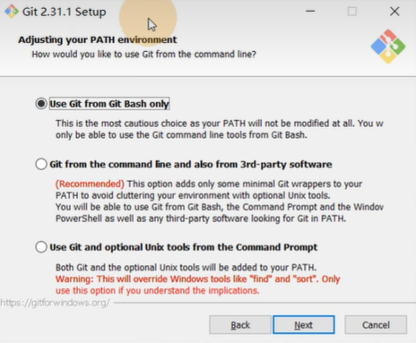
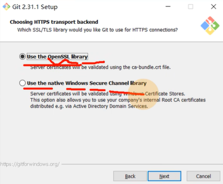
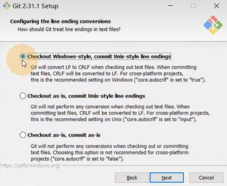
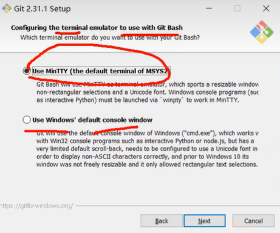
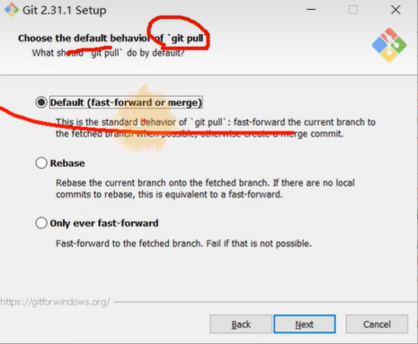
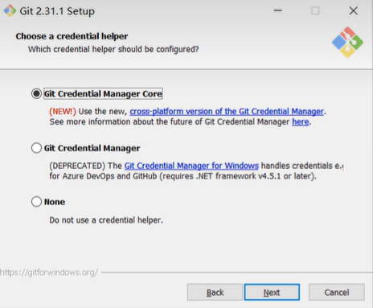
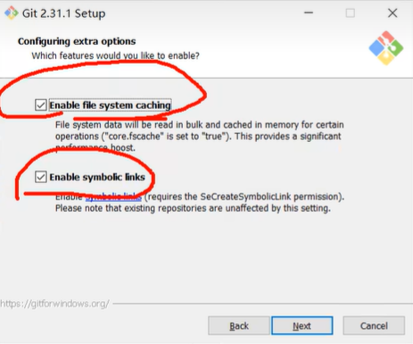
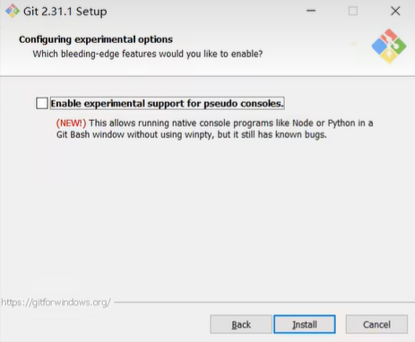
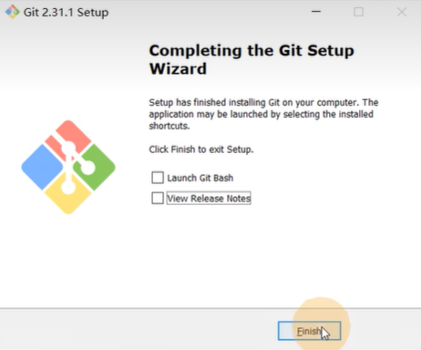

## 3. 